## 区块链是什么鬼？
译自：[WTF is The Blockchain?](https://hackernoon.com/wtf-is-the-blockchain-1da89ba19348)

译者：王瑶

通俗易懂的3500词英文指南让你理解区块链。
除非你与世隔绝，不然我敢肯定你听过比特币和区块链这两个名词。它是现今媒体最喜欢的话题和大势所趋，是今年的流行语。以至于从未“挖”过数字加密货币、不理解它怎样运作的人也在谈论它。我的朋友大多是非技术型而非技术型，他们求了我很长时间，让我把这个新流行语解释给他们听。我想应该有成千上万的人都像他们一样，而在这种时候，我理应写点让人们解答疑惑、指引方向的东西，也就是我现在所写的，这种可以让所有网民看懂的通俗文字。

**顺带一提，我是一家每周时事通讯，Unmade的负责人，为你的收件箱发送来自未来的想法。**

### 区块链：为什么我们需要这样复杂的东西？

“对于每个复杂的问题，都有一个看似简洁，实则错误的解答。” ——HL Mencken

与大部分你之前的读到的文章不同，上来就先给区块链下一个定义。我想先来说明白它可以帮我们解决的问题。

试想，乔是你最好的朋友。他在海外旅行，这是他假期的第五天，他打电话给你，说“杜德，我需要点钱。我的钱花完了。”

你回答：“我现在就寄给你。”，然后挂断电话。

于是你打电话给你银行的账户经理说：“请转给乔的账户1000美金。”

你的账户经理回答：“好的先生。”

他查询你的账户，查看你是否有足够多的账户余转1000美金给乔。你是一个富有的人，你有很多钱，因此，他这样在账本上写下：

***注意***：我们不是在讨论电脑，只为了让事情更简单。

你打电话给乔说：“我已经转了钱。下次你可以去银行取走我刚刚转给你的1000美金。”

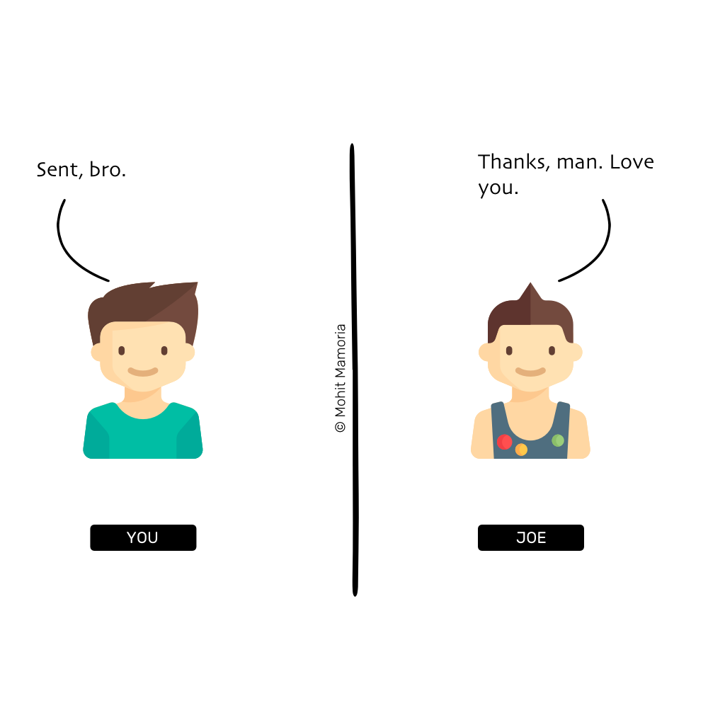

刚刚发生了什么？你和乔都把钱交给银行管理。这里并不存在任何实际的金钱交换。需要的只是一个在
账本上的记录。更准确地说，是你和乔都不能掌控和拥有的账本记录。

这就是当前系统的问题所在。

*为了建立我们之间的信任，我们依赖于独立的第三方。*

依靠一个值得信赖的第三方，例如银行，有什么问题呢？

问题就在于，银行的数量有限。如果要引起社会的混乱，所需要的仅仅是一个人或一个组织的腐败，无论有意无意。

* 如果账本上的交易记录被删除会怎样?
* 如果你的账户经理不小心把1000美金写成了1500美金该怎么办？
* 如果他是成心那样做的呢？

*多年以来，我们把我们所有的鸡蛋都放在一个篮子里，同时也放在另一个人的篮子里。*

#### 是否可以有这样一个系统，我们仍然可以转钱，却不用通过银行？

为了回答这个问题，我们需要进一步研讨，并向自己提出一个更深入的问题。（毕竟问题越深入，答案越明确）。

稍微想想，转账的意义是什么？只是账本上的一笔。那么更好的问题自然是——是否存在这样一种方式，我们可以自己保留交易记录并自我保护？

现在，这是一个值得探讨的问题。答案你或许已经猜到了。区块链就是这个深刻问题的答案。

它是一个帮助我们更好地保护交易信息而不需要第三人来参与的方法。

我的话你能听懂吗？很好。现在，一些问题开始徘徊在你的脑海中，下面我们开始学习区块链是怎样运转的。

### 好，告诉我，它怎样运作？

首先，区块链的应用也是有前提的，它需要社会中有足够多的人相信这项科技，并且不想在交易中引入第三方。只有这样一群人，才可以维护各自的账户信息和安全。
那么问题来了，多少才算足够多呢？不多，最少3个人就够了。我们举个例子吧，有10个人都不再相信银行或其他第三方机构，于是互相达成协议，他们24小时互相拥有其他9个人的账户的进出信息（以数字密钥的形式），但并不包含账户主体的隐私细节，例如流水金额，姓名或者密码等。

#### 1.始于一个空文件夹
一开始每个人都有一个空的文件夹。当我们开始交易时，这10个个人账户会持续向这个空文件夹中增加页面。然后这个页面集合将形成跟踪交易的寄存器。

#### 2.当一笔交易发生时
然后，网络上的每个人的手里都会拿着一张
空白纸和一一支笔，每个人都做好了交易发生时做记录的准备。

例如，#2想转帐100元给#9，那么#2也需要告诉其余8个人，“我准备向9转账10美金，请大家在自己的文件上记录一下，谢谢啦。”

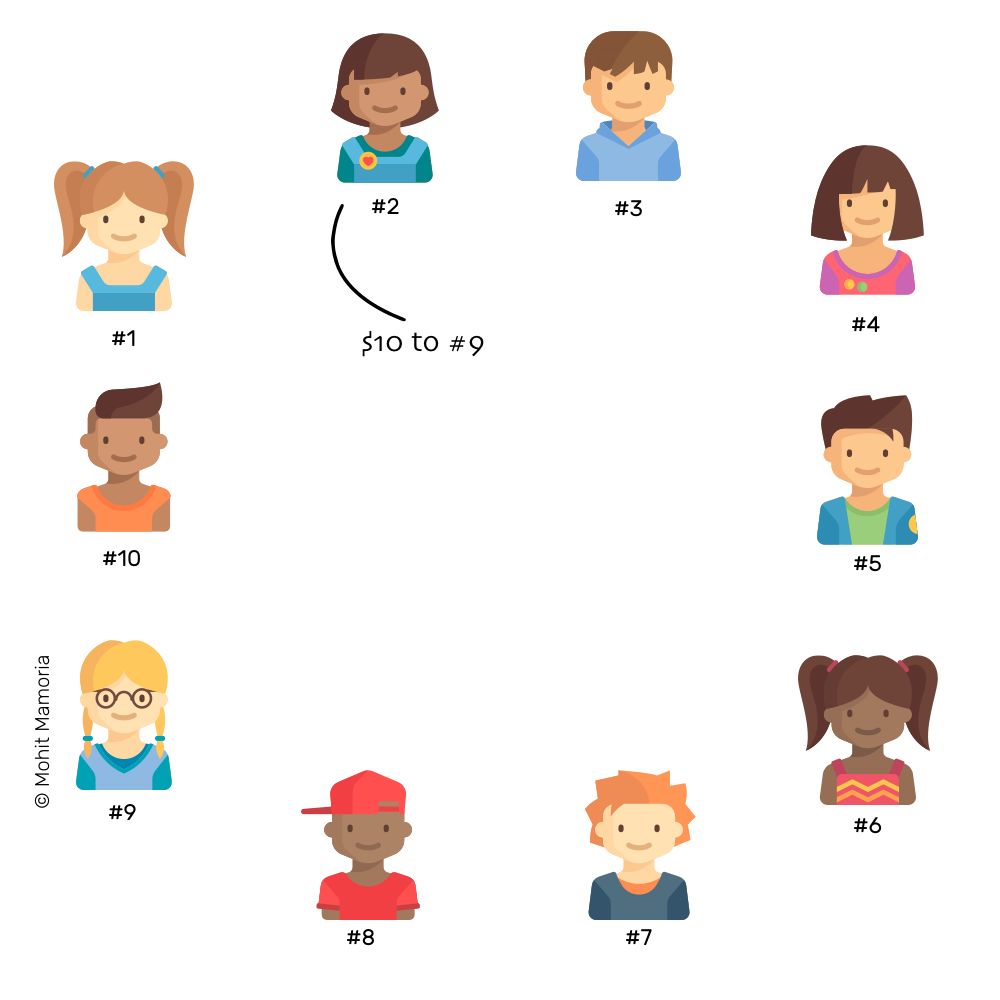

于是，其余8个人回去检查#2的账户余额里是否有足够的钱可以转给#9，如果有，交易会被执行，所有人也会在自己的文件上记录着交易的信息。

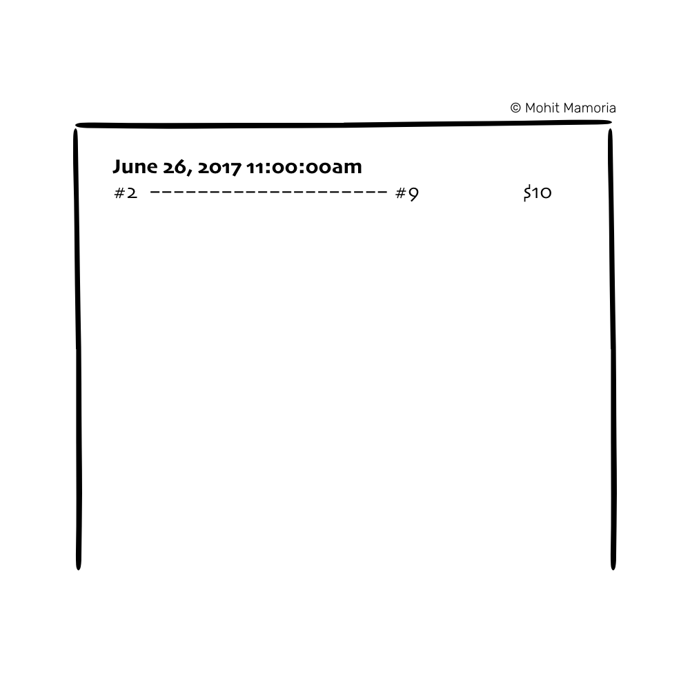
本页第一笔交易

这样交易就完成了。

#### 3.交易持续增长
随着时间的推移，网络上的人们有了更多的交易需求。当他们想要完成一笔交易他们会告诉其余的人，其余的人听到之后就会在他的页面上做一个记录。

这个步骤将会一直进行，直到每个人都用尽了当前页中的空白处。

这时候就要将这个页面封存到文件夹里，拿出新的一页，从步骤2开始做起。

#### 4.翻到新的一页之前
在我们翻到新的一页之前，要使用之前大家达成一致的密钥，对写满的这一页信息进行封装保护。通过封装，一旦信息被复制到每个人的文件夹里，我们可以确保没有人可以对其修改——今天不能、明天不能，甚至一年也不能。一朝在文件夹里，它就要生生世世待在文件夹里——被永久封存。此外，如果每个人都信赖封存技术，每个人就都信任文件里的内容。纸张的封装是这个方法的关键。

Jargon Box
这种保护页面的操作叫做“挖矿”。但是为了简单起见，我们把它称为“密封”。

早前，第三方（中间人）让我们相信他们写在账本上的记录不会被改变。而在像这样一个分布式和非集中式的系统中，封装给予我们信赖。

### 那么有趣的事情来了，我们怎么密封这些页面呢？
在我们学习怎样密封页面之前，我们要知道密封的原理。这是学习的先决条件。

#### 魔法机器
试想一台机器被厚厚的城墙包围。如果你把盒子里的东西从送进去，它会吐出一个盒子，里面装着别的东西。

Jargon Box
这台机器被叫做“哈希函数”，但是我们并不想技术性太强。所以今天，它们叫做“魔法机器”。

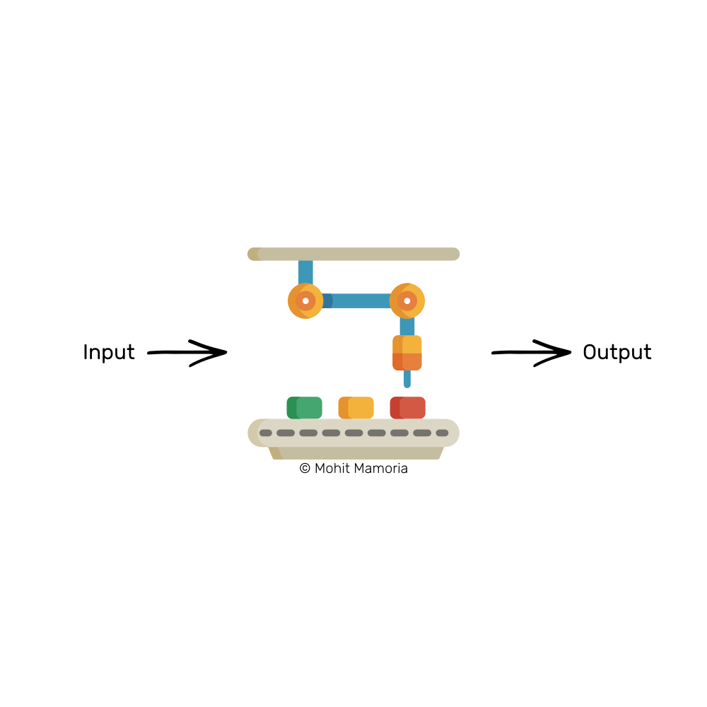

假设我们将数字“4”发送到这个机器，你会发现，他翻译出了“dcbea”。

这个机器是如何将“4”翻译成了这个字符串的呢？没有人知道。更重要的是，这是一个不可逆转的过程。给出'dcbea'，你不可能知道机器被输入了什么。再往机器回输“dcbea”，它不会再翻译出“4”。但是你每次输入4，都会翻译出同一个字符串。

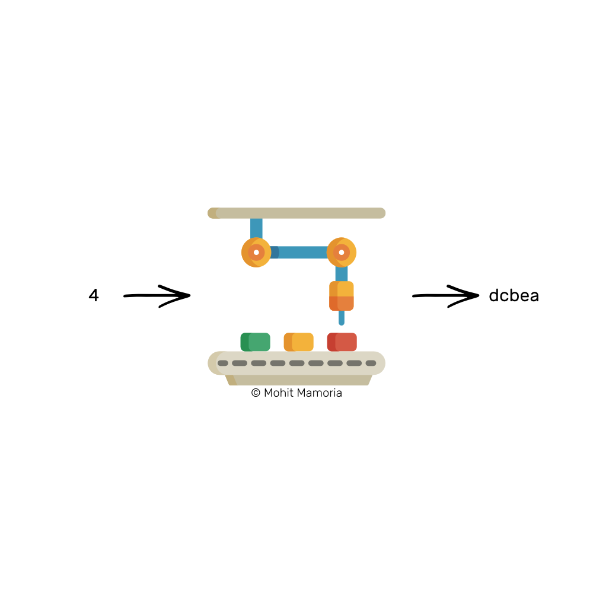

你不可能因为知道输出的结果是'dcbea'而推理出之前向机器里输入了什么。但是每当你输入4，它就会翻译成同一个字符串'dcbea'。

让我们尝试一个其他的数字。26怎么样？

这次我们得到了'94c8e'。真有趣！也就是说，字符串也可以包含数字。

那么现在我想问你一个问题:

“你能告诉我，如果我想得到一个以三个以0开头的字符串，我应该输入什么吗？”比如000ab,00098,000fa或是它们之间的任何字符串。

 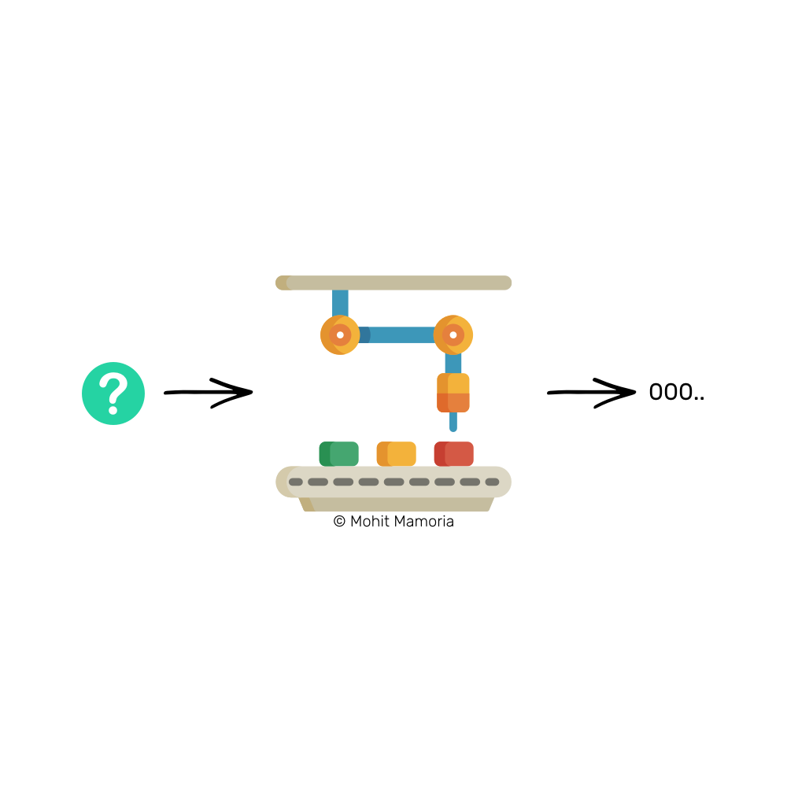

 静下来，想一想这个问题。

 我已经告诉你这个机器的特点是不能通过输出的结果推算输入值。我们有这样一台机器，怎么能回答出我之前问的问题？

 我想到一个方法。何不把宇宙中的数字都拿来一个一个试，直到得到一个以三个0开头的字符串？

 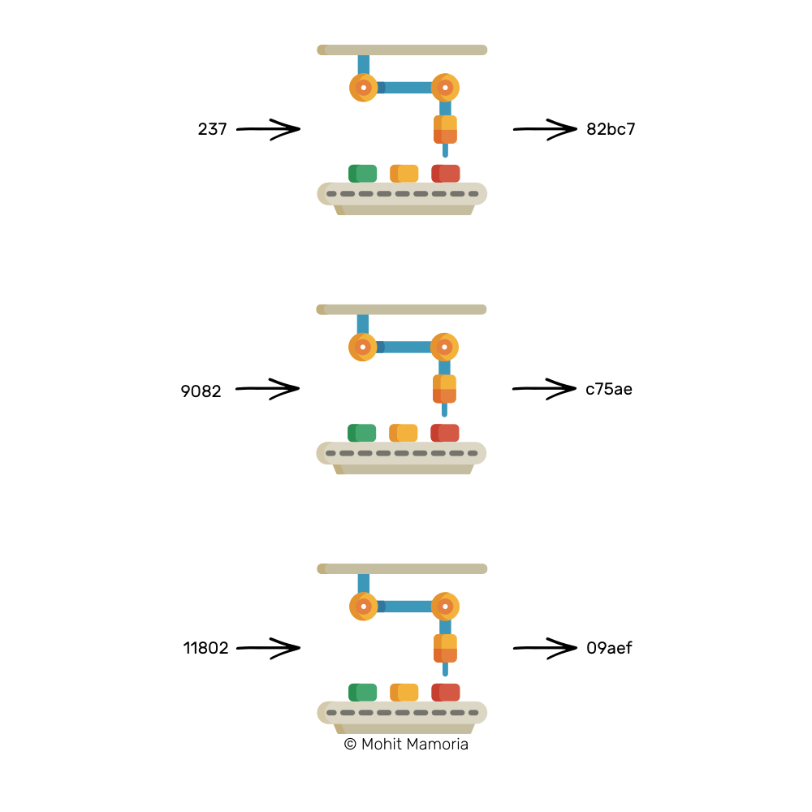

 乐观地说，经过几千次的尝试，我们最终会得到一个数字，这个数字将会在右边产生我们需要的输出。

 

 计算输出的输入是非常困难的。但同时，如果预测的输入能够产生所需的输出，则非常容易验证。请记住，机器每次都会吐出同一个字数的字符串。

 如果我给你一个号码，比如说72533，并问你一个问题，“这个号码，输入机器时，会产生一个三个0开头的单词吗？”，你会觉得有多困难？

 你只需要把数字输入机器并看看右边会输出什么。只是这样。

 这种机器最重要的特性就是——“给定一个输出，计算出输入数据是很困难的，但是给出输入输出，验证输入是否得到输出是很容易的。”

 通过接下来的文章我们将会记住魔法机器的这一属性:

 #### 怎样用这些机器封装一个页面？

 我们将使用这个魔法机器为我们封装页面。像之前一样，我们从一个虚拟的情景开始。

 试想我们有两个盒子。第一个盒子里有数字20893.然后我问你，你能找到一个数字，当你把它放进第一个盒子里，输入机器中就可以得到一个以三个0开头的单词吗？

 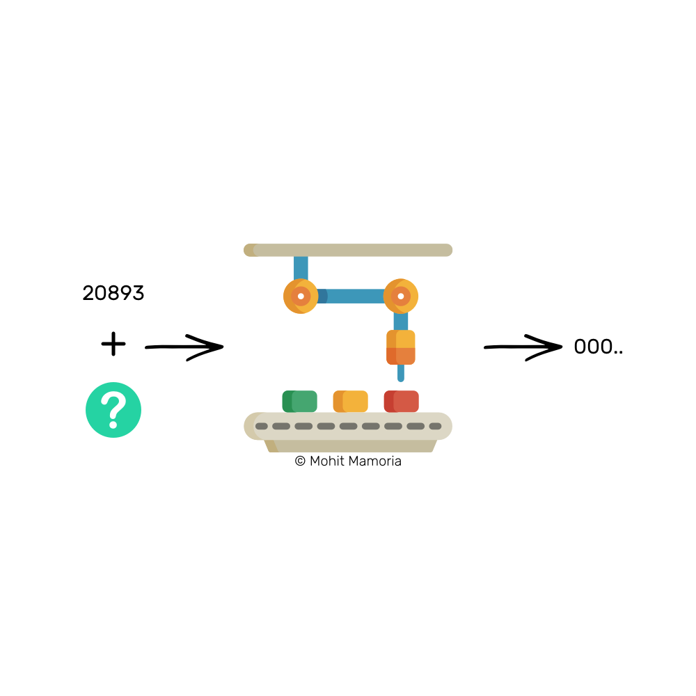

 这和我们之前看到的情景相似，我们已经知道计算这样数字的唯一方法是尝试宇宙上的所有数字。

 运气好的话，几万次后，你终于得到了正确的字符，假设它是“21191”，那么我们有了结论：（封装“21191”+原信息“20893”=42084）送入机器后会得到符合条件的字符。

 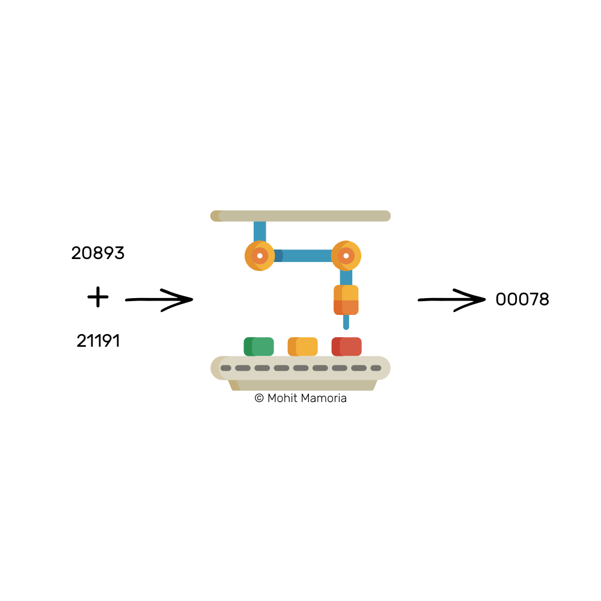

 在这种情况下，21191这个数字就变成了20893的封装码。假设有一个页面，上面写着20893。为了封装这一页面（也就是没人能修改内容），我们将在上面放上一个标有21191的印章。一旦封装码戳在了页面上，这个页面就被封装了。

 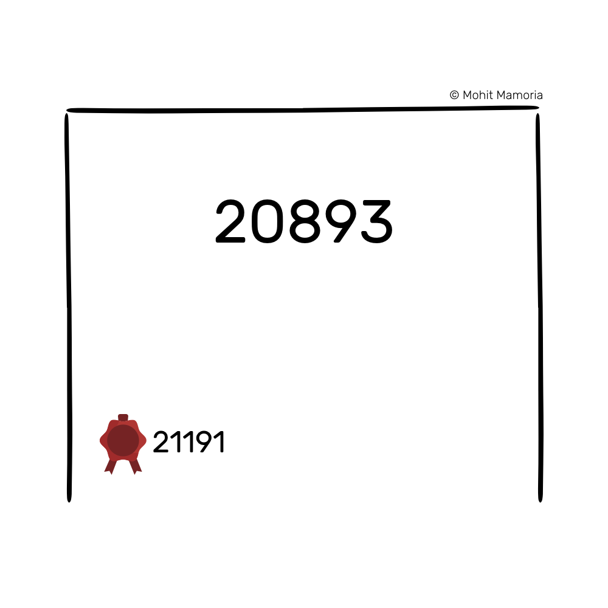

 [Jargon Box]封装码被称为“工作证明”，也就是说，这个数字是计算所付出努力的证明。和我们的用途相贴合，“封装码”这个名词很好。

 如果有人想确认页面是否被篡改，他所要做的就是——用封装码给页面添加内容并输入魔法机器。如果机器输出一个前三位都是零的单词，那么内容并未改变。如果输出的单词并非如此，我们就要去除这一页面。因为这一页面的内容被泄露，已经没有利用价值。

 我们将使用相似的封装原理来封装页面并最终整理到各自的文件夹里，

#### 最后，密封页面
为了封装包含网络交易信息的页面，我们需要找到一个数字，当我们记录交易清单并将其输入机器后，我们能得到一个以三个零开头的单词。

 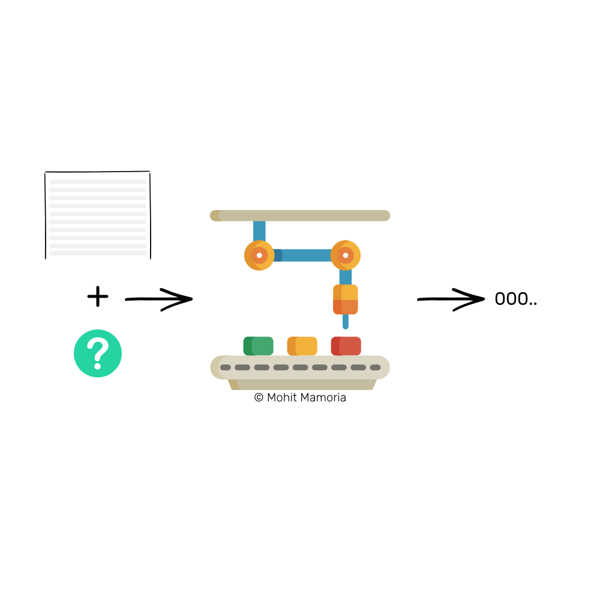

***注意***:我只是把“以三个零开头的单词”用来当例子。它演示了哈希函数的运行过程。真正的挑战比这个复杂很多。

一旦这个机器耗时耗电之后把这个数字计算出来，这个页面就用封装码封装了。如果有人试图更该页面内容，封装码会允许每个人检查页面是否完好。

现在我们知道了怎样去封装页面。让我们回到完成页面上第十项事务，没有空间去写更多东西的情景。

一旦用完了页面空间，不能再填写记录，他们满足于计算封装码，这样就可以妥当储存在文件夹中。网络上的每个人都做这样的计算。网络上第一个人找到封装码然后告诉每一个人。

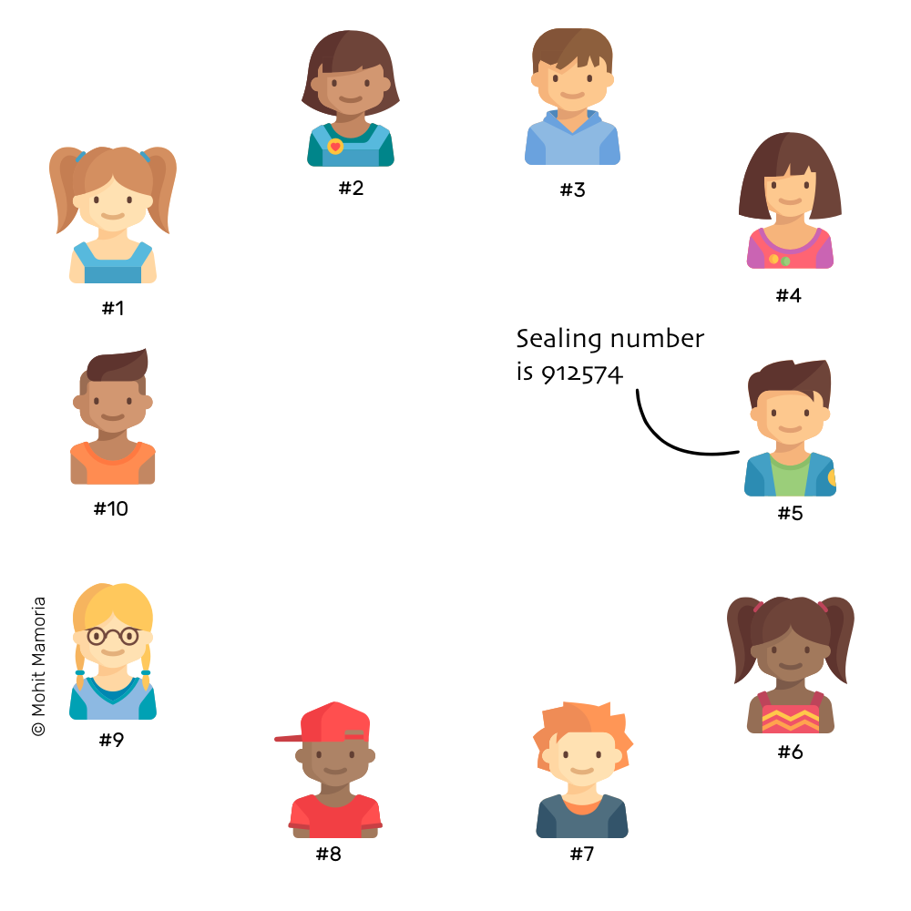

知道封装码后，每个人都会验证输出是否正确。如果正确，每个人都用这个数字标记他们的页面然后把它放到他们的文件夹里。

但是如果对于某人，比如说7，这个封装码不能产生正确的输出怎么办？这种情况并不罕见。可能的原因会有：
* 他可能误解了网络上宣布的交易。
* 他可能把网络中公布的交易写错了。
* 在记录交易时他可能试图欺骗或不诚实，为了自己或网络上的其他人。

不管原因是什么，7只有一个选择，放弃他的页面，并从别人那里复制，这样他也可以把它放在文件夹里。除非他不把自己的页面放在文件夹里，这样他就不能继续写更多的交易，这样，就禁止他成为网络的一员。

无论大多数的封装码是什么，都是真实的封装码。

#### 那么，为什么每个人都要耗费资源进行计算即使知道有人会计算并向他们公布时呢?为什么不坐着等着宣布？

好问题。这就是激励措施的作用。所有参与区块链的人都有资格获得奖励。第一个计算封装码的人会因为他的努力而得到报酬(例如，消耗的CPU和电力)。

简单地想象一下，如果5计算一个页面的封号，他会得到一些免费的钱，比如1美元，这些钱是凭空造出来的。换句话说，5美元的账户余额增加了1美元，而不减少其他账户余额。

比特币就是这样诞生的。这是第一个在区块链上进行交易的货币(也就是分布式注册表)。为了保持网络上的努力，作为回报，人们获得了比特币。

当足够多的人拥有比特币时，他们的价值就会增长，让其他人想要比特币;让比特币的价值进一步增长;让更多的人想要比特币;使他们的价值进一步增长;等等。

奖励使每个人都在网络中工作。

一旦每个人都在他们的文件夹里封存页面，他们就会拿出一个新的空白页面，然后重复整个过程，直到永远。

[Jargon Box] 可以将单个页面看作是一个事务块，而该文件夹是页面链(块)，因此，将其称为区块链。

我的朋友们，这就是区块链的运作方式。

。 。 。

然而我还有一件小事没告诉你。

想象一下，这个文件夹里已经有5页了，都是密封的。如果我返回到第二页并修改一个交易事项会怎样?这个封装码可以让任何人检测到交易中的不一致性，对吗?如果我继续为修改过的事务计算一个新的密封编号然后用它来标记页面会怎样？

为了防止有人返回并修改页面(块)和封装码的问题，对于如何计算一个密封号，有一个小的改动。

### 保护对封装码的修改
还记得我是怎么告诉你的吗？我给了你两个盒子，其中一个是20893，另一个是空的，你可以计算，是这样吧？实际上，要计算区块链的封装码，不是两个盒子，而是有三个——两个预填充，一个要计算。

当所有这三个箱子的内容被输入到机器里时，输出的答案必须满足所要求的条件。

我们已经知道，一个盒子包含了交易列表，一个盒子将包含封装码。第三个盒子包含前一页的魔法机器的输出。

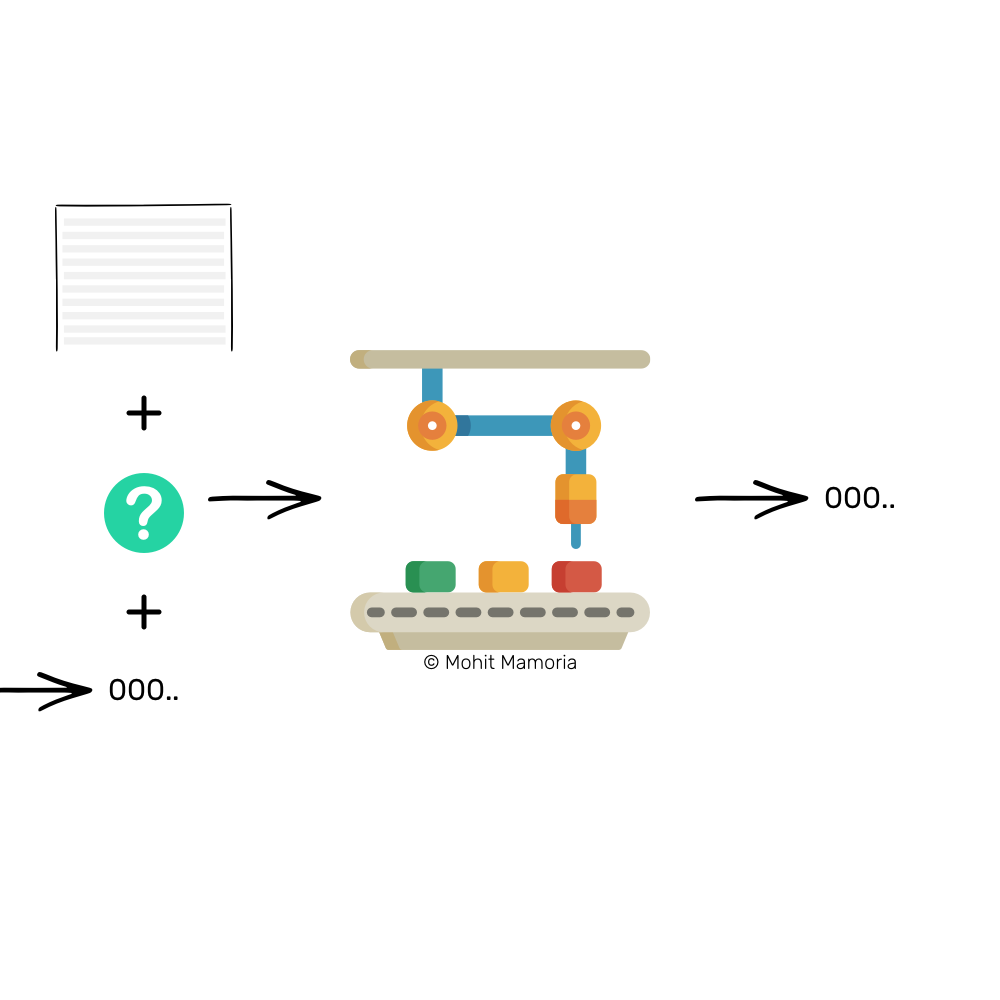

有了这个巧妙的小技巧，我们确保每个页面都依赖于它的前一页。因此，如果某人必须修改历史页面，那么他也必须更改所有页面的内容和封号，以保持链的一致性。

如果一个人，从我们最初设想的十个人中，试图欺骗和修改区块链的内容(包含带有交易列表的页面的文件夹)，他将不得不调整几个页面，并计算所有这些页面的新封装码。我们知道计算封装数是多么困难。因此，一个不诚实的人在网络上不能打败9个诚实的人。

然后会发生的是,对页面不诚实的家伙试图作弊,他会创建另一个链的网络,但这链永远无法赶上诚实链，因为一个人的努力和速度无法打败九个人累积的努力和速度。因此，这样就保证网络中最长的链是真实的链。

当我告诉你一个不诚实的人不能打败九个诚实的人时，你的脑海中会响起铃声吗？

### 如果不是一个，而是九个人都不诚实怎么办？
在这种情况下，协议将会被取消。它被称为51%的攻击。如果网络中的大多数人不诚实并且欺骗网络的其他部分，那么该协议将会失效。

这是区块链可能会崩溃的唯一脆弱的原因。要知道，这种情况不太可能发生，但我们都必须知道系统的弱点。它建立在这样一个假设之上:大多数人都是诚实的。

我的朋友们，这些都是关于区块链的。如果你发现有人感觉忘了什么是区块链，“区块链是什么鬼？”你知道你可以让他们看这篇文章。收藏这个链接。

你能想到谁应该读这篇文章?共享按钮就在这里。

### 关于作者

Mohit Mamoria是一份每周通讯的策展人，他把想法从未来发送到你的收件箱。

译于2017年10月7日
 
